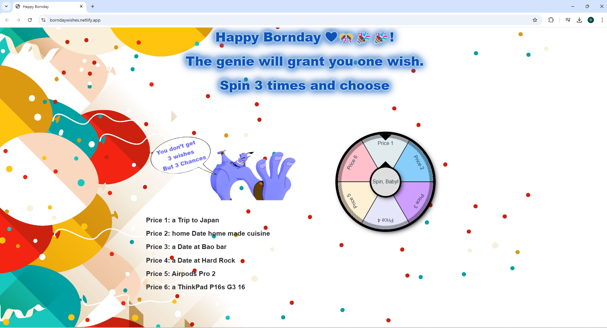

# a simply birthday fun app

some issues on web, but on mobile its working, test: https://borndaywishes.netlify.app/

https://codesandbox.io/p/sandbox/vue3-roulette-c8tml?file=%2Fsrc%2FApp.vue%3A12%2C2-50%2C5

built with Vu3 using Options API,
for the spinner I used a roulette component: https://roulette.nitocode.com/docs,
I don't play russian roulette but I guess its fine

* purpose of the app: the person who's birthday it is,
can decide through spinning what she/he wishes as a birthday present

* The Genie from Aladin normally grants 3 wishes, but we don't wanna indulge
the person, so she only gets to pick one of the wishes she obtained by spinning the wheel 3 times

* You can edit the prices as you want, e.g if they seem to expensive, you can add also instead
places, like restaurants, what ever comes to your mind !

* For publishing online, I'm simply using netlify for simplicity

